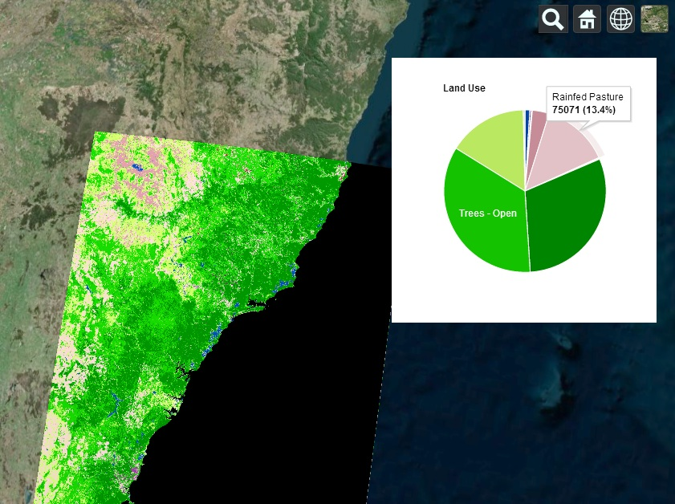

# Cesium Project Template

### Introduction

This is a [Cesium](http://cesiumjs.org/) template project using the following javascript libraries...
* [Google Charts](https://developers.google.com/chart/)
* [jQuery](http://jquery.com/)

### Get up and running

#### Build Environment

* Follow the instructions at their [github page]() to get up and running

#### Install

Once you have cesium up and running

* Copy the sample code in this folder into a folder under Apps in your cesium folder
* Start up their server if not running usually with command similar to the one below

    ./Tools/apache-ant-1.8.2/bin/ant release runServer

* Run land_cover.html from their server.  

    http://localhost:8080/Apps/sample/land_cover.html

